# 🎭 BAIS1C VACE Dance Sync Suite

<div align="center">

**Modular ComfyUI Node Collection for Procedural, Audio-Reactive, and Filmmaking-Grade Pose & Dance Animation**


</div>

---

## 🚀 Features

<table>
<tr>
<td width="50%">

### 🎯 **Flexible Input System**
- Pose extraction from video or sequential images
- Fully audit-compliant processing
- Batch processing support

### 🤖 **DWPose Integration** 
- State-of-the-art per-frame human pose estimation
- 128-point full-body tracking
- High accuracy pose detection

### 🔄 **Meta Consistency**
- Unified `sync_meta` propagation
- Robust dataflow throughout pipeline
- Seamless node chaining

</td>
<td width="50%">

### 🎵 **Audio/Music Reactivity**
- Real-time music synchronization
- BPM analysis and beat detection
- Beat-driven movement modulation

### 🧩 **Modular Architecture**
- ComfyUI-style node design
- Easy to extend and customize
- Drop-in workflow integration

### 💾 **Library Support**
- Portable JSON pose sequences
- Rich metadata preservation
- Easy reuse and remixing

</td>
</tr>
</table>

---

## 🛠️ Node Collection

| Node | Purpose | Key Features |
|------|---------|-------------|
| **🎬 BAIS1C_PoseExtractor** | Extracts pose from video/images | DWPose integration, batch processing |
| **🎵 BAIS1C_MusicControlNet** | Music-driven pose modulation | Beat sync, BPM analysis |
| **💃 BAIS1C_SimpleDancePoser** | Procedural dance generation | Parameterized sequences |
| **🎭 BAIS1C_Suite_DancePoser** | Advanced music animation | Multi-bodypart EQ, complex sync |
| **💾 BAIS1C_SavePoseJSON** | Pose library management | JSON export, metadata preservation |

---

## 📋 Requirements

### Core Dependencies
```bash
pip install torch numpy librosa opencv-python onnxruntime decord
```

### System Requirements
- **Python**: 3.8 or higher
- **ComfyUI**: Latest version recommended
- **GPU**: CUDA-compatible (recommended for performance)

### Required Libraries
| Library | Purpose | Version |
|---------|---------|---------|
| `torch` | PyTorch deep learning | Latest |
| `numpy` | Numerical computing | Latest |
| `librosa` | Audio analysis | Latest |
| `opencv-python` | Computer vision | Latest |
| `onnxruntime` | DWPose inference | Latest |
| `decord` | Video processing | Latest |

---

## 🚀 Installation & Setup

### 1. Clone Repository
```bash
cd /path/to/ComfyUI/custom_nodes/
git clone https://github.com/yourusername/bais1c-vace-dance-sync.git
```

### 2. Install Dependencies
```bash
cd bais1c-vace-dance-sync
pip install -r requirements.txt
```

### 3. Download DWPose Models
Place the following ONNX models in `models/dwpose/`:
- `yolox_l.onnx`
- `dw-ll_ucoco_384.onnx`

### 4. Create Library Directory
```bash
mkdir dance_library
```

### 5. Restart ComfyUI
The nodes will appear under **BAIS1C VACE Suite/** in the node browser.

---

## ⚡ Quick Start

### Basic Workflow

```mermaid
graph LR
    A[📹 Video/Images] --> B[🎬 PoseExtractor]
    B --> C[🎵 MusicControlNet]
    C --> D[💃 DancePoser]
    D --> E[💾 SavePoseJSON]
    
    F[🎶 Audio File] --> C
    E --> G[📚 Dance Library]
```


### Example Usage
1. **Extract poses** from your source video or image sequence
2. **Add music reactivity** to sync movements with audio
3. **Generate or modify** dance sequences with procedural nodes
4. **Save to library** for future use and remixing
5. **Export** for VACE/WAN video generation

> 💡 **Pro Tip**: Always pass `sync_meta` through each node to retain context and settings!

---

## 🎬 What's Next: Cinematic Motion Libraries

<details>
<summary><strong>🎯 Roadmap Overview</strong></summary>

### Phase 1: Motion Library Foundation
- **Curated Action Catalog**: Running, jumping, combat, character idles
- **Rich Metadata**: BPM, action types, loop settings, camera tags
- **JSON Format**: Standardized, portable pose sequence storage

### Phase 2: Film-Ready Tools
- **Sequence Blending**: Smooth transitions between actions
- **Tempo Control**: Adjust timing for dramatic pacing
- **Shot Metadata**: Camera angles, timing, narrative tags

### Phase 3: Cinematic Controls
- **Style Transfer**: Apply emotional overlays (happy/sad/energetic)
- **Camera Planning**: Automated camera movement suggestions
- **Shot Scripting**: Timeline-based editing metaphor

### Phase 4: VACE/WAN Integration
- **Direct Pipeline**: Pose sequences → video generation
- **Prompt Templating**: Automated scene description
- **Batch Processing**: Generate multiple takes rapidly

### Phase 5: Community & Tools
- **Library Contributions**: Community-driven pose collections
- **Preview Tools**: Browser-based sequence visualization
- **Remix Engine**: Combine and modify existing sequences

</details>

---

## 🤝 Contributing

We welcome contributions! Here's how you can help:

### 🐛 Bug Reports
Found an issue? [Open a GitHub Issue](https://github.com/yourusername/bais1c-vace-dance-sync/issues)

### 💡 Feature Requests
Have an idea? We'd love to hear it! Submit a feature request.

### 🔧 Code Contributions
1. Fork the repository
2. Create a feature branch: `git checkout -b feature/amazing-feature`
3. Commit your changes: `git commit -m 'Add amazing feature'`
4. Push to branch: `git push origin feature/amazing-feature`
5. Open a Pull Request

### 📚 Library Contributions
Help expand our motion library! See `/dance_library/README.md` for the pose JSON specification.

---

## 📚 Documentation & Resources

### Official Documentation
- [📖 Full Documentation](https://github.com/yourusername/bais1c-vace-dance-sync/wiki)
- [🎯 API Reference](https://github.com/yourusername/bais1c-vace-dance-sync/blob/main/docs/api.md)
- [🎬 Tutorial Videos](https://github.com/yourusername/bais1c-vace-dance-sync/blob/main/docs/tutorials.md)

### External Resources
- [ComfyUI Documentation](https://github.com/comfyanonymous/ComfyUI)
- [DWPose Paper & Models](https://github.com/IDEA-Research/DWPose)
- [Librosa Audio Analysis](https://librosa.org/doc/latest/index.html)
- [Decord Video Processing](https://github.com/dmlc/decord)
- [WAN 2.1 Knowledge Base](https://notion.so)

---

## 📄 License

This project is licensed under the MIT License - see the [LICENSE](LICENSE) file for details.

---

## 💬 Support & Community

<div align="center">

### Get Help
[](https://discord.gg/yourdiscord)
[](https://github.com/yourusername/bais1c-vace-dance-sync/discussions)

### Follow Updates
[](https://twitter.com/BAIS1C)
[](https://github.com/BAIS1C)

</div>

---

<div align="center">

**Made with ❤️ by the BAIS1C Team**

*Every saved action, pose, and animation is fully remixable and ready for AI filmmaking, VACE, or experimental video.*

⭐ **Star this repo if you found it helpful!** ⭐

</div>