# 🎭 BAIS1C VACE Dance Sync Suite

<div align="center">

**Next-Generation ComfyUI Node Collection for Procedural, Audio-Reactive, and Filmmaking-Grade Pose & Dance Animation**

[](https://github.com/BAIS1C/BAIS1Cs_VACE_DANCE_SYNC_SUITE/stargazers)
[](https://github.com/BAIS1C/BAIS1Cs_VACE_DANCE_SYNC_SUITE/network)
[](LICENSE)
[](https://www.python.org/)
[](https://github.com/comfyanonymous/ComfyUI)

**Transform videos into precision-synced dance animations with advanced audio analysis and DWPose extraction**

[🚀 Installation](#-installation--setup) • [📖 Documentation](#-workflow-overview) • [💬 Discord Community](#-community--support) • [🌐 Website](#-community--support)

</div>

---

## ✨ What Makes This Special

**BAIS1C VACE Dance Sync Suite** revolutionizes dance and pose animation in ComfyUI by providing:

- 🎵 **Intelligent Audio Analysis**: Multi-method BPM detection, beat tracking, and frequency band analysis
- 🕺 **Advanced Pose Extraction**: DWPose-powered 128-point skeletal tracking with temporal smoothing
- 🎬 **VACE-Ready Output**: Fully compatible with WAN 2.1 and VACE video generation models
- 🔄 **Metadata-Driven Pipeline**: Zero manual parameter entry - everything flows through smart metadata
- 🎨 **Creative Freedom**: From precise sync to experimental dance generation

---

## 🚦 Workflow Overview

The pipeline is designed for **fast, robust, and modular pose/music extraction and sync**:

```mermaid
graph TD
    A[🎦 VHS_LoadVideo<br/>Images + Audio] --> B[📦 BAIS1C_SourceVideoLoader<br/>BPM Detection & Meta Prep]
    B --> C[🎬 BAIS1C_PoseExtractor<br/>DWPose + Metadata]
    C --> D[🎵 BAIS1C_MusicControlNet<br/>Beat Sync & Modulation]
    D --> E[💃 BAIS1C_SimpleDancePoser<br/>Creative Dance Generation COMING SOON]
    E --> F[💾 BAIS1C_SavePoseJSON<br/>Library Export COMING SOON]
    
    style A fill:#e1f5fe
    style B fill:#f3e5f5
    style C fill:#e8f5e8
    style D fill:#fff3e0
    style E fill:#fce4ec
    style F fill:#f1f8e9
```



### 🔥 Key Innovation: Zero Manual Input

Unlike traditional workflows, **every technical parameter flows automatically**:
- ✅ **BPM**: Auto-detected via robust multi-method analysis
- ✅ **FPS**: Extracted from video metadata
- ✅ **Duration**: Calculated and synced across all nodes
- ✅ **Beat Times**: Precise onset detection with confidence scoring
- ✅ **Frequency Bands**: 7-band EQ analysis for music reactivity

---

## 🛠️ Node Collection

| Node | Purpose | Key Features |
|------|---------|--------------|
| **📦 BAIS1C_SourceVideoLoader** | Meta-intelligent video prep | Audio/video pass-through, robust BPM detection, unified metadata |
| **🎬 BAIS1C_PoseExtractor** | Advanced pose extraction | DWPose integration, 128-point tracking, temporal smoothing |
| **🎵 BAIS1C_MusicControlNet** | Pose/music synchronization | Beat alignment, frequency-reactive modulation, swing detection |
| **💃 BAIS1C_SimpleDancePoser** | Creative dance generation | Built-in styles, music reactivity, parametric control |
| **📦 BAIS1C_PoseCheckpoint** | Pose data management | Instant save/forward, metadata preservation |
| **💾 BAIS1C_SavePoseJSON** | Library export | VACE-ready JSON, full metadata embedding |

---

## 🚀 Installation & Setup

### 1. Clone the Repository
```bash
cd /path/to/ComfyUI/custom_nodes/
git clone https://github.com/BAIS1C/BAIS1Cs_VACE_DANCE_SYNC_SUITE.git
```

### 2. Install Dependencies
```bash
cd BAIS1Cs_VACE_DANCE_SYNC_SUITE
pip install -r requirements.txt
```

### 3. Download DWPose Models
Place these models in `/ComfyUI/models/dwpose/`:
- `yolox_l.onnx` - Object detection model
- `dw-ll_ucoco_384.onnx` - Pose estimation model

**Download links**: [HuggingFace - DWPose Models](https://huggingface.co/yzd-v/DWPose)

### 4. Restart ComfyUI
The nodes will automatically register on restart.

---

## 📋 Dependencies

```txt
torch>=1.13.0
numpy>=1.21.0
librosa>=0.9.0
opencv-python>=4.5.0
onnxruntime>=1.12.0
decord>=0.6.0
scipy>=1.7.0
```

---

## 🎯 Quick Start Example

1. **Load Video**: Use `VHS_LoadVideo` to import your dance video
2. **Prep Metadata**: Connect to `BAIS1C_SourceVideoLoader` - BPM auto-detected!
3. **Extract Poses**: Feed to `BAIS1C_PoseExtractor` - 128-point tracking engaged
4. **Sync to Music**: Use `BAIS1C_MusicControlNet` for beat-perfect alignment
5. **Generate Variations**: Experiment with `BAIS1C_SimpleDancePoser`
6. **Export**: Save with `BAIS1C_SavePoseJSON` for VACE workflows

**Result**: Professional-grade pose animations, perfectly synced to music, ready for AI video generation!

---

## 🎨 Features Showcase

### 🎵 Advanced Audio Analysis
- **Multi-Method BPM Detection**: Combines onset detection, beat tracking, and spectral analysis
- **Confidence Scoring**: Know how reliable your BPM detection is
- **7-Band EQ Analysis**: Bass, mid, highs, and more for reactive animation
- **Swing & Syncopation Detection**: Understands musical complexity

### 🕺 Precision Pose Tracking
- **128-Point Skeletal Model**: Full body, hands, and face tracking
- **Temporal Smoothing**: Eliminates jitter while preserving natural movement
- **Batch Processing**: Handle long videos efficiently
- **DWPose Integration**: State-of-the-art pose estimation

### 🎬 VACE & WAN Integration
- **Metadata Preservation**: Every detail flows to final output
- **Frame-Perfect Sync**: Beats align exactly with keyframes
- **JSON Export**: Ready for WAN 2.1 and other AI video models
- **Library System**: Build reusable dance move collections

---

## 🔧 Advanced Configuration

### Audio Analysis Settings
```python
# Enhanced audio analysis parameters
bpm_range = (60, 180)
confidence_threshold = 0.6
freq_bands = {
    'sub_bass': (20, 60),
    'bass': (60, 250),
    'low_mid': (250, 500),
    'mid': (500, 2000),
    'high_mid': (2000, 4000),
    'highs': (4000, 8000),
    'air': (8000, 20000)
}
```

### Pose Extraction Options
- **Temporal Smoothing**: 0.0-1.0 (0.1 recommended)
- **Batch Size**: Optimize for your VRAM
- **Output Format**: 128-point normalized coordinates

---

## 📚 Integration Examples

### With VACE Models
```json
{
  "title": "my_dance_sequence",
  "metadata": {
    "primary_bpm": 128.5,
    "duration": 12.4,
    "fps": 24.0,
    "beat_consistency": 0.94
  },
  "pose_tensor": "[[normalized coordinates...]]"
}
```

### With WAN 2.1
Perfect compatibility with WAN workflows - poses export with full temporal metadata for seamless AI video generation.

---

## 🐛 Troubleshooting

### Common Issues

**DWPose models not found**:
- Ensure models are in `/ComfyUI/models/dwpose/`
- Check file permissions
- Verify model file integrity

**Audio analysis fails**:
- Check librosa installation: `pip install librosa>=0.9.0`
- Ensure audio format is supported (WAV, MP3, etc.)
- Try with shorter audio clips first

**Memory issues**:
- Reduce batch size in pose extraction
- Use temporal smoothing sparingly on long videos
- Consider splitting long videos into segments

---

## 🗺️ Roadmap

### 🎬 Cinematic Motion Library
- [ ] **Cinematic Action Poses**: Hero stances, dramatic gestures, fight choreography
- [ ] **Realistic Walking Cycles**: Natural gait patterns, terrain adaptation, character walks
- [ ] **Idle Animations**: Breathing, fidgeting, ambient character movements
- [ ] **Combat Motion Capture**: Martial arts, sword fighting, hand-to-hand combat
- [ ] **Realistic Motion Cap Integration**: Professional mocap data import and processing

### 💃 Advanced Dance & Performance
- [ ] **Advanced Dance Styles**: Ballet, breakdancing, contemporary, cultural dances
- [ ] **Performance Categories**: Stage presence, theatrical gestures, crowd interaction
- [ ] **Multi-Person Choreography**: Group dance sequences, synchronized movements

### 🎥 Cinematic Production Tools
- [ ] **Camera Motion Integration**: Sync camera moves to action beats and music
- [ ] **Scene Composition**: Action framing, dramatic angles, cinematic timing
- [ ] **Character Interaction**: Two-person scenes, dialogue gestures, reactive poses

### 🚀 Technical Advancement
- [ ] **Real-Time Preview**: Live pose generation feedback and adjustment
- [ ] **VACE 2.0 Integration**: Next-generation model support and optimization
- [ ] **3D Pose Export**: Blender, Maya, and Unreal Engine integration
- [ ] **Motion Blending**: Seamless transitions between different action types

---

## 🤝 Community & Support

<div align="center">

### 💬 Join Our Community

[](https://discord.gg/v7WdD94UXK)

**Get help, share creations, and collaborate with fellow creators!**

### 🌐 Visit Our Website

[](https://strandsnation.xyz)

**Explore tutorials, showcases, and advanced techniques**

### 📧 Developer Contact

**BAIS1C** - Creator & Lead Developer  
*Pushing the boundaries of AI-assisted creativity*

</div>

---

## 🙏 Acknowledgments

- **DWPose Team**: For excellent pose estimation models
- **ComfyUI Community**: For the incredible extensible framework  
- **Librosa Developers**: For robust audio analysis tools
- **WAN & VACE Teams**: For revolutionary video generation models

---

## 📄 License

This project is licensed under the MIT License - see the [LICENSE](LICENSE) file for details.

---

<div align="center">

**Made with ❤️ and 🤖 by BAIS1C**

*Every saved pose is fully remixable and ready for next-gen AI video, VACE, or experimental filmmaking.*

⭐ **Star this repo if it helped your creative journey!** ⭐

[](https://github.com/BAIS1C)
[](https://discord.gg/v7WdD94UXK)
[](https://strandsnation.xyz)

</div>
